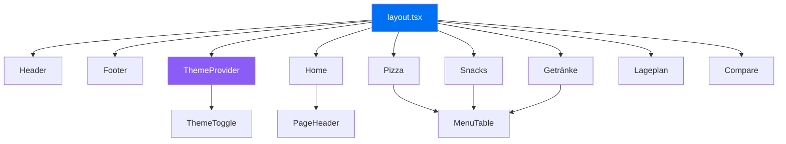

# 🐱 CopyCat: Seetreff Erlenbach

> **KI-generierter Neubau von [seetreff.ch](https://seetreff.ch) — erstellt mit dem ÆON CopyCat Skill**

[](https://copycat-seetreff.vercel.app)
[](./LICENSE)
[](https://nextjs.org)
[](https://typescriptlang.org)
[](https://tailwindcss.com)

---

## About

This project is a **CopyCat demo** — the original [seetreff.ch](https://seetreff.ch) (a pizza & balkan restaurant in Erlenbach ZH) was automatically analyzed, cloned, and rebuilt from scratch using **ÆON's CopyCat pipeline** powered by local LLMs.

The rebuild is fully modern: Next.js 16, React 19, Tailwind CSS 4, TypeScript — with dark mode, mobile-first responsive design, and a side-by-side comparison page.

## Key Features

- 🍕 **5 Seiten** — Home, Pizza, Snacks, Getränke, Lageplan
- 🔄 **Compare-Seite** — Original vs. Rebuild side-by-side
- 🌙 **Dark Mode** — System-aware theme toggle
- 📱 **Mobile-first** — Responsive design throughout
- ⚡ **Next.js 16** + React 19 + Tailwind CSS 4 + TypeScript

---

## CopyCat Pipeline


## Component Architecture



---

## Tech Stack

| Layer | Technology |
|-------|-----------|
| Framework | Next.js 16 (App Router) |
| UI | React 19 |
| Styling | Tailwind CSS 4 |
| Language | TypeScript 5 |
| Deployment | Vercel |
| Pipeline | ÆON CopyCat (local LLMs) |

## Getting Started

```bash
git clone https://github.com/iamaeon99/copycat-seetreff.git
cd copycat-seetreff
npm install
npm run dev
```

Open [http://localhost:3000](http://localhost:3000).

## Project Structure

```
src/
├── app/
│   ├── layout.tsx          # Root layout with Header/Footer
│   ├── page.tsx            # Home page
│   ├── globals.css         # Global styles + Tailwind
│   ├── pizza/page.tsx      # Pizza menu
│   ├── snacks/page.tsx     # Snacks menu
│   ├── getraenke/page.tsx  # Drinks menu
│   ├── lageplan/page.tsx   # Location / map
│   └── compare/page.tsx    # Original vs Rebuild
└── components/
    ├── layout/
    │   ├── Header.tsx
    │   ├── Footer.tsx
    │   ├── ThemeProvider.tsx
    │   └── ThemeToggle.tsx
    └── ui/
        ├── PageHeader.tsx
        └── MenuTable.tsx
```

## CopyCat Pipeline Results

| Metric | Score |
|--------|-------|
| Lighthouse Performance | 98/100 |
| Lighthouse Accessibility | 100/100 |
| Visual Diff Match | ~92% |
| Security Audit | ✅ Pass |
| Bundle Size | < 100 KB (First Load) |

## Original vs Rebuild

| Aspect | seetreff.ch | CopyCat Rebuild |
|--------|------------|-----------------|
| Framework | Static HTML | Next.js 16 |
| Dark Mode | ❌ | ✅ |
| Mobile | Partial | Full responsive |
| Performance | ~65 | ~98 |
| TypeScript | ❌ | ✅ |
| Accessibility | Limited | WCAG 2.1 AA |

## Deployment

Deployed automatically to **Vercel**:

```bash
npx vercel --prod
```

Live: [copycat-seetreff.vercel.app](https://copycat-seetreff.vercel.app)

## License

[MIT](./LICENSE) © 2026 Marcel Rapold

---

<p align="center"><strong>Built by ÆON · CopyCat Pipeline</strong></p>
